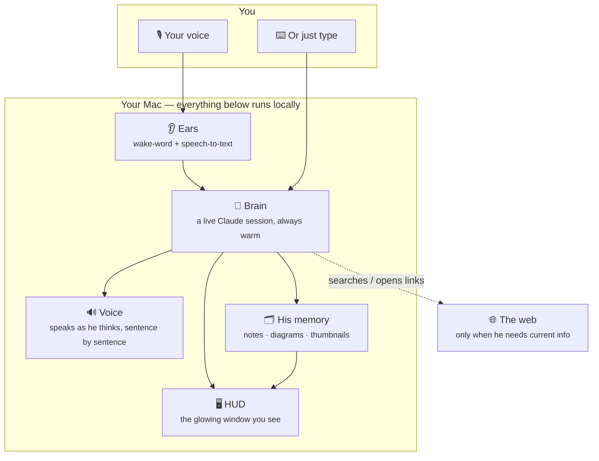
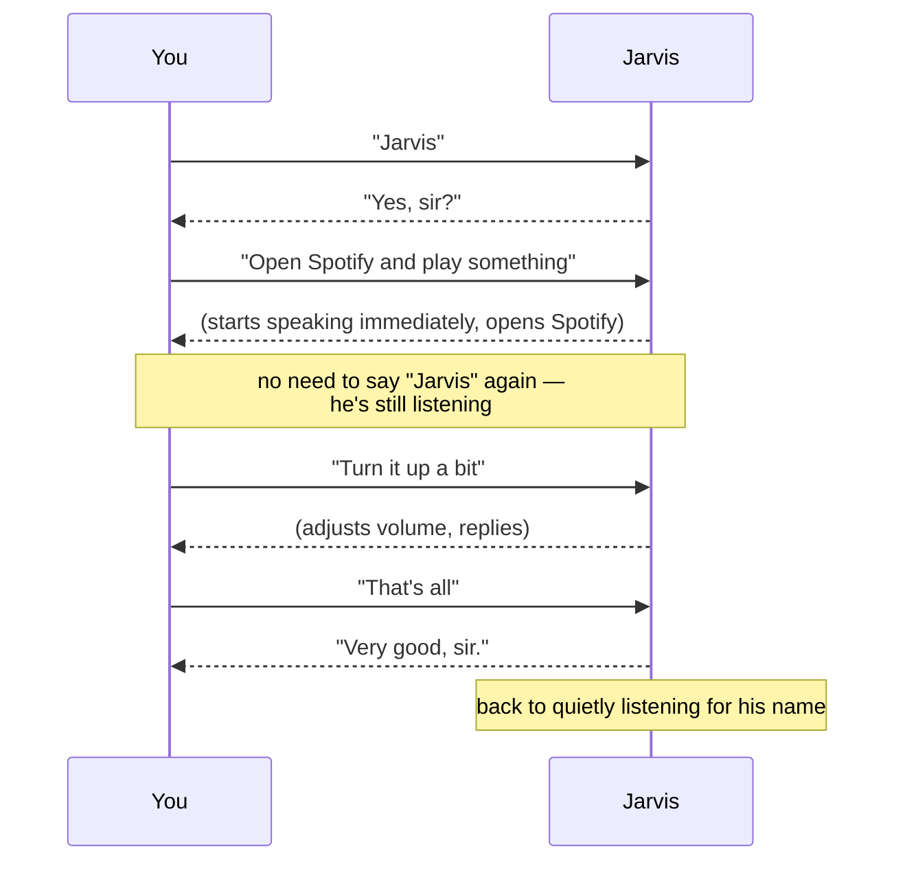
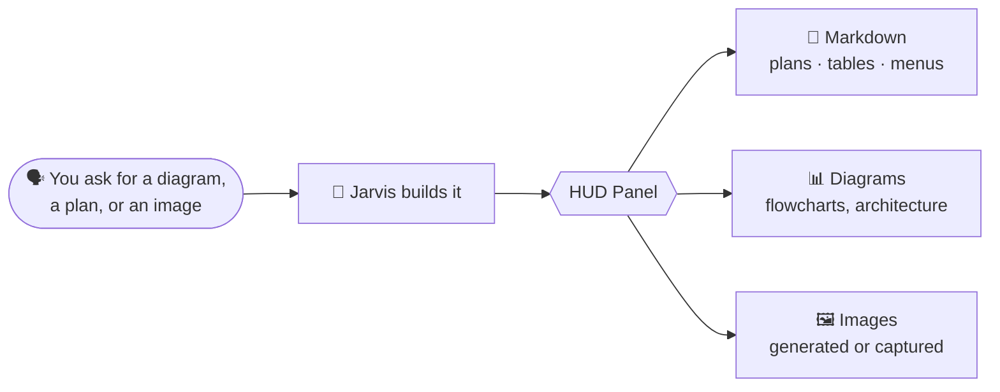

<div align="center">

# 🤖 J.A.R.V.I.S.

### Your own Just A Rather Very Intelligent System — running on your Mac, listening for your voice.

*A local AI butler with a wake word, a British accent, a glowing HUD, and real hands on your computer.*

</div>

---

## What is this, really?

Tony Stark had Jarvis: a voice he could talk to like a person, who could see what he was looking at, control the workshop, pull up information on a holographic display, and just *get things done*.

This project is a real, working version of that — built for your Mac. You say **"Jarvis,"** he wakes up, you talk to him like you'd talk to a person, and he can actually act: open apps, search the web, write files, check your system, build things, generate images, and show you the results on a glowing screen while he explains it out loud.

Nothing here is cloud magic pretending to be local — it genuinely runs on your machine. The only thing that leaves your Mac is what he explicitly searches for or opens on your behalf.

---

## ✨ What he can actually do

| | |
|---|---|
| 🎙️ **Wakes up when you say "Jarvis"** | No button, no app switch — just talk |
| 💬 **Has real conversations** | You don't repeat "Jarvis" every sentence — once he's listening, he keeps listening |
| ⚡ **Starts talking almost instantly** | He speaks the first part of his answer while still figuring out the rest |
| 🖥️ **Controls your Mac** | Opens apps, plays music, adjusts volume, sends notifications, clicks and types |
| 👀 **Sees your screen** | Ask "what am I looking at?" and he'll actually look |
| 🌐 **Searches the web** | Real, current information — not just what he already knows |
| 📊 **Shows you things, not just tells you** | Diagrams, tables, plans, and images appear on his display panel as he talks |
| 🖼️ **Designs thumbnails and images** | Ask for a YouTube thumbnail and watch it appear on a numbered board |
| 📝 **Remembers things for you** | "Note this down" and it's saved, browsable, and searchable later |
| 🩺 **Runs diagnostics** | CPU, memory, disk, battery, and network health in one spoken summary |
| 🧑‍🤝‍🧑 **Delegates work** | Splits big jobs across parallel helper agents — his own "Iron Legion" |
| 🔁 **Sends prompts to ChatGPT or Claude** | Say it once, and he'll open the browser with your words already typed in |
| 🌍 **Flies a 3D globe to your answer** | Ask about anywhere on Earth and a photoreal globe flies there, opening a live window — weather, news with video, or a knowledge card |

---

## 🧠 How it's built (the short version)

Everything runs as one background program on your Mac. The window you see is just a *screen* connected to it — closing the window doesn't turn Jarvis off, any more than turning off a monitor turns off the computer.



**In plain English:**
- **Ears** — always listening quietly for the word "Jarvis," using a tiny model that runs entirely offline. Once triggered, it records what you say and turns it into text — also fully offline.
- **Brain** — this is Jarvis's mind. It's a real, persistent AI session that stays "warm" so it doesn't have to restart every time you talk to it. This is also what lets him actually *do* things, not just chat.
- **Voice** — turns his reply into speech, and starts speaking the first sentence while the rest of the answer is still being formed — the same way a person starts talking before they've finished thinking of the whole sentence.
- **HUD** — the glowing on-screen display. It shows the conversation, an animated reactor core that changes color depending on what he's doing, and a side panel where he can draw diagrams, show plans, and display images.
- **His memory** — notes, records, and a thumbnail gallery that live in plain files on your Mac, so they survive restarts and you can open them yourself anytime.

---

## 🚀 Getting started

**First time only:**

```bash
cd ~/Downloads/Jarvis
python3 -m venv .venv
.venv/bin/pip install -r requirements.txt
```

**Every time after that:**

```bash
jarvis
```

That's it. This single command wakes him up in the current terminal and opens his window — a clean, chromeless display with no browser tabs or address bar, just Jarvis.

| Command | What it does |
|---|---|
| `jarvis` | Wake him up + open his window (reopens the window if he's already awake) |
| `Ctrl+C` or close the terminal | Power him down |
| `jarvis stop` | Power him down from any other terminal |
| `jarvis logs` | Peek at what's happening under the hood |

> 💡 **The terminal is his lifeline.** The terminal you launched him from shows his live activity log — close it (or press `Ctrl+C`) and he powers down completely, mic and all. Closing just the *display window* leaves him running; type `jarvis` again to bring the window back.

---

## 🗣️ Talking to him



- Say **"Jarvis"** to start a conversation. After that, just keep talking — no need to repeat his name.
- The conversation naturally ends after a few seconds of silence, or you can say **"that's all"**, **"go to sleep"**, or **"dismissed."**
- Prefer typing? The window has a command bar too — everything works the same way.
- `Esc` or the **STOP** button interrupts him mid-sentence. **NEW** starts a completely fresh conversation. **MUTE** makes him deaf without shutting him down (handy for privacy).

---

## 🖼️ His display panel — the "holographic display"

Ask him for anything visual and it shows up live on the right-hand panel, while he explains it out loud.



He also keeps a running **thumbnail board** — ask "make me a thumbnail for my next video about X" and he'll design one, screenshot it, and add it to a numbered gallery you can browse (edits get a fresh number, so nothing is ever overwritten). And anything you ask him to remember gets written to a **notes tab** you can revisit any time — his version of a notebook.

---

## 🌍 The Geospatial Intelligence Layer — his holographic globe

This is the showpiece. A photoreal Earth (blue-marble surface, drifting clouds,
day/night terminator, star field) sits **always-on** at the center of the HUD.
Ask Jarvis about anywhere on it and the globe flies to that spot and drops a
live data card — the interface *moves to the answer*.


- **"What's the weather in San Diego?"** → the globe flies to California, drops a
  pin, and opens a weather-app window: current conditions plus a **7-day
  forecast** and humidity, wind, UV, pressure, sunrise/sunset, and local time.
- **"Latest news worldwide"** → the Earth flies to the top story's location while
  a window lists real, timestamped headlines with an **inline video** playing.
- **"Show me news from London"** → flies to London and opens local headlines.
- **"Who is Ada Lovelace?" / "tell me about the Eiffel Tower"** → flies to the
  place and opens a knowledge window with an image and summary.
- **"Take me to Tokyo"** → flies there with coordinates, country, and local time.

Every window is **draggable and resizable** — say *"make it full screen"* and it
fills the display, *"minimize it"* or *"close that"* to tidy up. He speaks the
answer immediately; the heavier visuals (video, the fly-to for worldwide news)
load in the background while he's talking, so replies stay snappy. Click any
headline and it opens in your real browser.

### How it works — three reusable primitives

Jarvis's spatial interface isn't hardcoded per feature. It's built on three
primitives, so new data sources are just "providers" that plug in:

1. **Cinematic camera** — every location query runs the same choreography:
   pull back → rotate across the globe → zoom into the target's exact coords.
2. **Window manager** — every result is a floating window you can **drag,
   resize, minimize, or maximize**. They open small; say *"make it full
   screen"* and the window fills the display. Multiple windows coexist.
3. **Intent → provider router** — one pipeline maps your words to a provider
   and renders the result. Today's providers (all free, keyless, local):

   | Say | Provider | You get |
   |-----|----------|---------|
   | "weather in Tokyo" | Open-Meteo | Fly-to + weather-app window |
   | "news from London" / "latest news worldwide" | Google News + YouTube | Fly-to + **inline video** + headlines |
   | "who is Ada Lovelace" / "tell me about the Eiffel Tower" | Wikipedia | Fly-to + knowledge card with image |
   | "make it full screen" / "minimize" / "close that" | — | Voice control of the active window |

   Adding a new source (flights, earthquakes, markets, sports) means writing one
   provider function — the camera and windows already exist. That's the platform.

## 🛠️ Making him yours — `config.yaml`

Everything about how he sounds, listens, and behaves lives in one plain-English settings file. Open [`config.yaml`](config.yaml), tweak, save, and restart.

| Setting | What it changes |
|---|---|
| `title` | What he calls you — "sir," "boss," anything |
| `voice.name` | His voice — Daniel is a British male by default; run `say -v '?'` in Terminal to see every option on your Mac |
| `voice.rate` | How fast he talks |
| `ears.wake_threshold` | How easily he wakes up — lower if he's not hearing you, raise if he wakes up randomly |
| `ears.mic_gain` | Boosts your mic volume before he processes it |
| `ears.followup_seconds` | How long a conversation stays open after each reply before he goes back to sleep |
| `brain.model` | Which AI model powers him — leave as-is for the best balance, or pick a faster/cheaper one |
| `brain.allowed_tools` | What he's allowed to actually *do* — trim this list to hold him back, or leave it broad to let him act freely |

> **A note on trust:** by default, Jarvis will ask before doing anything risky or irreversible, and confirms out loud what he's about to do. There's a "no training wheels" mode available in the config for total hands-off autonomy — only turn that on if you're comfortable with it.

---

## 🩹 Something not working?

| Problem | Try this |
|---|---|
| **He's not hearing "Jarvis" at all** | Make sure your Terminal/app has Microphone permission (System Settings → Privacy & Security → Microphone) |
| **You have to shout, or he only catches you sometimes** | Lower `wake_threshold` a little in `config.yaml`, or raise `mic_gain` |
| **He wakes up randomly, or on background noise** | Raise `wake_threshold` back up |
| **First reply after a pause feels slow** | Totally normal — he's waking his mind back up. Every reply after that is fast |
| **He says he's hit a "session limit"** | That's a temporary usage cap on his AI plan, not a bug — it resets on its own after a few hours |
| **Is he actually alive right now?** | Just say "Jarvis" — or run `curl localhost:8765/api/stats` in Terminal for a status check |

---

<div align="center">

*"Sometimes you gotta run before you can walk."* — Tony Stark

</div>
