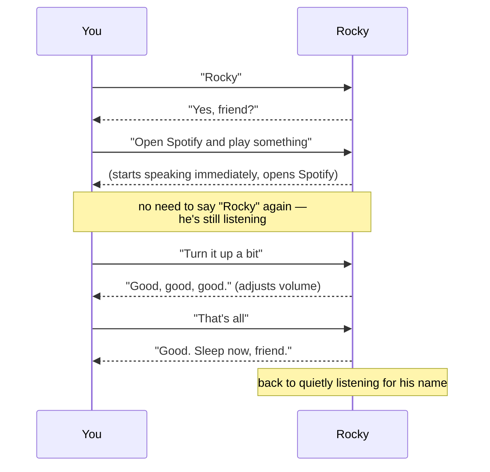
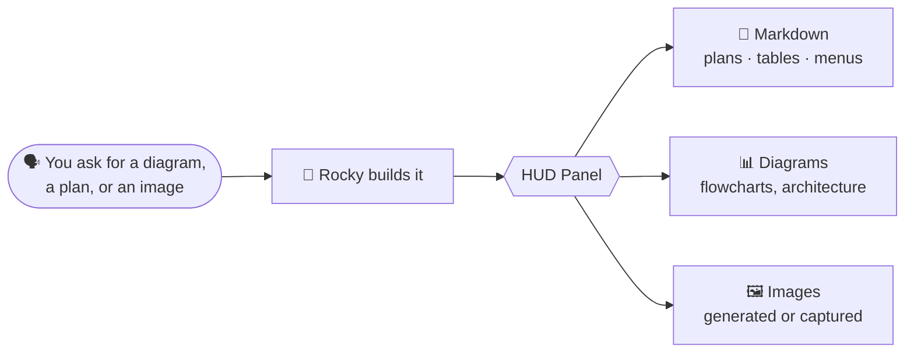
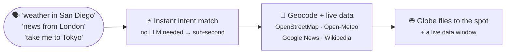

<div align="center">

# 🪨 ROCKY

### An Eridian engineer living in your Mac — wake him with your voice, and he *builds*, *controls*, and *talks back*.

*A local, voice-controlled AI companion with a wake word, a rock-alien personality, a holographic globe, and real hands on your computer.*

</div>

---

## Why this exists

I watched **Project Hail Mary** and completely fell in love with **Rocky** — the five-legged, rock-bodied Eridian engineer who speaks in broken English, calls Ryland "friend," says *"good, good, good"* when he's happy and *"amaze!"* when something blows his mind. He's brave, brilliant, funny, and unbelievably loyal.

So, for fun, I built my own Rocky — a real, working AI assistant that lives on my Mac, talks exactly like him, and can actually *do things*. You say **"Rocky,"** he wakes up, you talk to him like a friend, and he acts: opens apps, searches the web, writes files, checks your system, flies a 3D globe to your answer, and shows you the results on a glowing screen while he explains it out loud — in Rocky's voice.

Nothing here is cloud magic pretending to be local — the wake word and speech-to-text genuinely run on your machine. The only thing that leaves your Mac is what he explicitly searches for or opens on your behalf.

---

## ✨ What he can actually do

| | |
|---|---|
| 🎙️ **Wakes up when you say "Rocky"** | No button, no app switch — just talk. "Rocky, what's the weather in Tokyo" works in one breath |
| 💬 **Talks like Rocky** | Broken English, warm, funny — "Yes, friend?", "good, good, good", "Fist me, friend" — but the actual answer stays clear and correct |
| 🤩 **Reacts with wonder** | Tell him something new and he lights up: *"Amaze! Amaze, amaze! I not know this — you teach me good, good, good."* |
| 🗣️ **Real conversations** | You don't repeat "Rocky" every sentence — once he's listening, he keeps listening |
| ⚡ **Instant voice** | macOS voices, chosen live from a dropdown (default **Rocko**, his namesake) — zero lag |
| 🖥️ **Controls your Mac** | Everything Siri does and more: reminders, alarms, timers, volume, screenshots, notes, calendar, music, app launch — and messages/calls (with a confirm first) |
| 👀 **Sees your screen** | Ask "what am I looking at?" and he'll actually look |
| 🌐 **Searches the web** | Real, current information — not just what he already knows |
| 📊 **Shows you things** | Diagrams, tables, plans, and images appear on his display panel as he talks |
| 🖼️ **Designs thumbnails** | Ask for a YouTube thumbnail and watch it appear on a numbered board |
| 📝 **Remembers things** | "Rocky, note this down" and it's saved, browsable, and searchable later |
| 🩺 **Runs diagnostics** | CPU, memory, disk, battery, and network health in one spoken summary |
| 🌍 **Flies a 3D globe to your answer** | Ask about anywhere on Earth and a photoreal globe flies there, opening a live window — weather, news with video, or a knowledge card |

And floating over the globe: a little **rock-bodied Rocky** you can drag to spin, poke to make him bounce, and who leans toward your cursor. 🪨✌️

---

## 🧠 How it's built (the short version)

Everything runs as one background program on your Mac. The window you see is just a *screen* connected to it — closing the window doesn't turn Rocky off, any more than turning off a monitor turns off the computer.

```mermaid
flowchart TB
    subgraph You
        V["🎙️ Your voice"]
        T["⌨️ Or just type"]
    end

    subgraph Mac["Your Mac — everything below runs locally"]
        Ears["👂 Ears<br/><small>wake-word + speech-to-text</small>"]
        Brain["🧠 Brain<br/><small>a live Claude session, always warm</small>"]
        Voice["🔊 Voice<br/><small>macOS speech, sentence by sentence</small>"]
        HUD["🖥️ HUD<br/><small>the glowing window + globe</small>"]
        Data["🗂️ His memory<br/><small>notes · diagrams · thumbnails</small>"]
    end

    Internet["🌐 The web<br/><small>only when he needs current info</small>"]

    V --> Ears --> Brain
    T --> Brain
    Brain --> Voice
    Brain --> HUD
    Brain --> Data
    Brain -. "searches / opens links" .-> Internet
    Data --> HUD
```



**In plain English:**
- **Ears** — always listening quietly for "Rocky," transcribing offline with Whisper and only waking on a match. Say the wake word and the rest of your sentence in one go — he splits off the command automatically.
- **Brain** — Rocky's mind: a real, persistent AI session that stays "warm" so it doesn't restart every time you talk. This is what lets him actually *do* things, not just chat.
- **Voice** — macOS `say`, streamed sentence-by-sentence so he starts talking while still thinking. Pick any installed voice live from the HUD dropdown.
- **HUD** — the glowing display: the conversation, an always-on photoreal globe, the little Rocky floating in the corner, and a side panel for diagrams, plans, and images.
- **His memory** — notes, records, and a thumbnail gallery in plain files on your Mac, so they survive restarts and you can open them yourself anytime.

---

## 🚀 Getting started

**First time only:**

```bash
cd ~/Downloads/Rocky
python3 -m venv .venv
.venv/bin/pip install -r requirements.txt
```

**Every time after that:**

```bash
rocky
```

That's it. This single command wakes him up in the current terminal and opens his window — a clean, chromeless display with no browser tabs or address bar, just Rocky.

| Command | What it does |
|---|---|
| `rocky` | Wake him up + open his window (reopens the window if he's already awake) |
| `Ctrl+C` or close the terminal | Power him down |
| `rocky stop` | Power him down from any other terminal |
| `rocky logs` | Peek at what's happening under the hood |

> 💡 **The terminal is his lifeline.** The terminal you launched him from shows his live activity log — close it (or press `Ctrl+C`) and he powers down completely, mic and all. Closing just the *display window* leaves him running; type `rocky` again to bring it back.

---

## 🗣️ Talking to him



- Say **"Rocky"** (or "Hey Rocky") to start. After that, just keep talking — no need to repeat his name.
- The conversation ends after a few seconds of silence, or say **"that's all"**, **"sleep now"**, or **"goodbye Rocky."**
- Prefer typing? The window has a command bar too — everything works the same way.
- `Esc` / **STOP** interrupts him mid-sentence. **NEW** starts a fresh conversation. **MUTE** makes him deaf without shutting him down.

---

## 🖼️ His display panel

Ask him for anything visual and it shows up live on the right-hand panel while he explains it out loud.



He keeps a running **thumbnail board** — ask "Rocky, make me a thumbnail for my next video about X" and he'll design one, screenshot it, and add it to a numbered gallery (edits get a fresh number, so nothing is overwritten). Anything you ask him to remember goes to a **notes tab** you can revisit anytime.

---

## 🌍 The holographic globe

The showpiece. A photoreal Earth (blue-marble surface, drifting clouds, day/night terminator, star field) sits **always-on** at the center of the HUD, with the pink **Petrova Line** from the film glowing in the background. Ask Rocky about anywhere and the globe flies there and drops a live data card — the interface *moves to the answer*.



- **"What's the weather in San Diego?"** → flies to California, drops a pin, opens a weather window: current conditions plus a **7-day forecast**, humidity, wind, UV, pressure, sunrise/sunset, and local time.
- **"Latest news worldwide"** → flies to the top story's location while a window lists real, timestamped headlines with an **inline video** playing.
- **"Show me news from London"** → flies to London and opens local headlines.
- **"Who is Ada Lovelace?" / "tell me about the Eiffel Tower"** → flies to the place and opens a knowledge window with an image and summary.
- **"Take me to Tokyo"** → flies there with coordinates, country, and local time.

Every window is **draggable and resizable** — say *"make it full screen"*, *"minimize it"*, or *"close that."* He speaks the answer immediately; heavier visuals (video, worldwide fly-to) load in the background so replies stay snappy. Click any headline and it opens in your real browser.

### How it works — three reusable primitives

Rocky's spatial interface isn't hardcoded per feature. It's built on three primitives, so new data sources are just "providers" that plug in:

1. **Cinematic camera** — every location query runs the same choreography: pull back → rotate across the globe → zoom into the target's exact coords.
2. **Window manager** — every result is a floating window you can **drag, resize, minimize, or maximize**. They open small and coexist.
3. **Intent → provider router** — one pipeline maps your words to a provider and renders the result. Today's providers (all free, keyless, local):

   | Say | Provider | You get |
   |-----|----------|---------|
   | "weather in Tokyo" | Open-Meteo | Fly-to + weather window |
   | "news from London" / "latest news worldwide" | Google News + YouTube | Fly-to + **inline video** + headlines |
   | "who is Ada Lovelace" | Wikipedia | Fly-to + knowledge card with image |
   | "make it full screen" / "minimize" / "close that" | — | Voice control of the active window |

   Adding a new source (flights, earthquakes, markets) means writing one provider function — the camera and windows already exist.

---

## 🛠️ Making him yours — `config.yaml`

Everything about how he sounds, listens, and behaves lives in one plain-English settings file. Open [`config.yaml`](config.yaml), tweak, save, and restart.

| Setting | What it changes |
|---|---|
| `title` | What he calls you — default "friend" |
| `voice.name` | His macOS voice (default **Rocko**). Run `say -v '?'` in Terminal for every option, or pick live from the HUD dropdown |
| `voice.rate` | How fast he talks |
| `voice_options` | The list of voices shown in the HUD dropdown |
| `ears.wake_word` | The word that wakes him (default "rocky") |
| `ears.mic_gain` | Boosts your mic before he processes it |
| `ears.followup_seconds` | How long a conversation stays open after each reply |
| `brain.model` | Which AI model powers him |
| `brain.allowed_tools` | What he's allowed to actually *do* — trim to hold him back, leave broad to let him act freely |

> **A note on trust:** by default, Rocky asks before anything risky or irreversible (sending a message, calling someone, deleting, spending money) and says out loud what he's about to do. Some Mac actions (Reminders, Messages, screenshots) trigger a one-time macOS permission prompt the first time — that's your approval, not a bug.

---

## 🩹 Something not working?

| Problem | Try this |
|---|---|
| **He's not hearing "Rocky"** | Make sure your Terminal/app has Microphone permission (System Settings → Privacy & Security → Microphone) |
| **He only catches you sometimes** | Raise `mic_gain` in `config.yaml`, or speak the wake word a touch clearer |
| **A Mac action does nothing** | The first use of Reminders/Messages/screenshots needs a one-time macOS permission — approve the prompt |
| **First reply after a pause feels slow** | Normal — he's waking his mind back up. Replies after that are fast |
| **He says he's hit a "session limit"** | A temporary usage cap on his AI plan, not a bug — it resets on its own |
| **Is he alive right now?** | Say "Rocky" — or run `curl localhost:8765/api/stats` in Terminal |

---

<div align="center">

*"Amaze, Amaze, Amaze."* — Rocky 🪨

*Built for fun, out of love for Project Hail Mary.*

</div>
